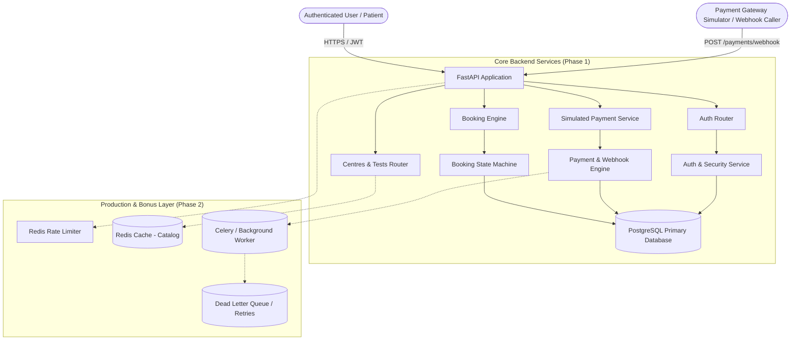
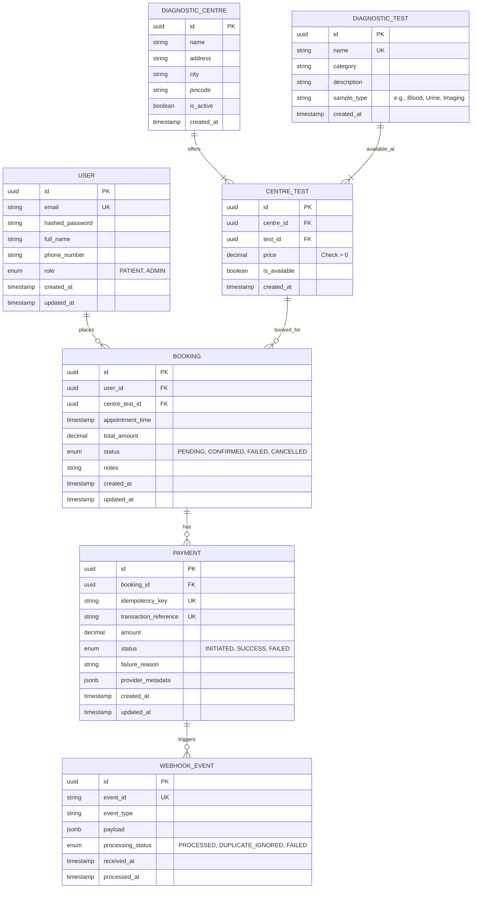
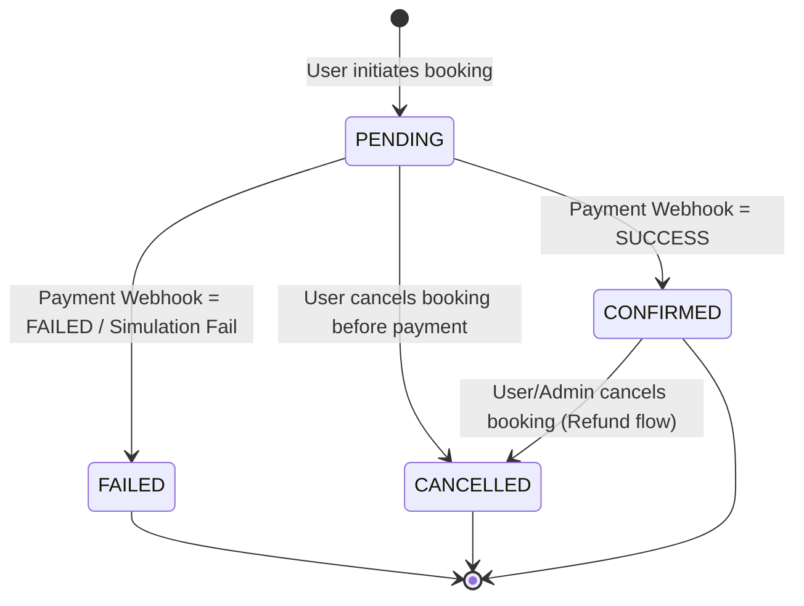
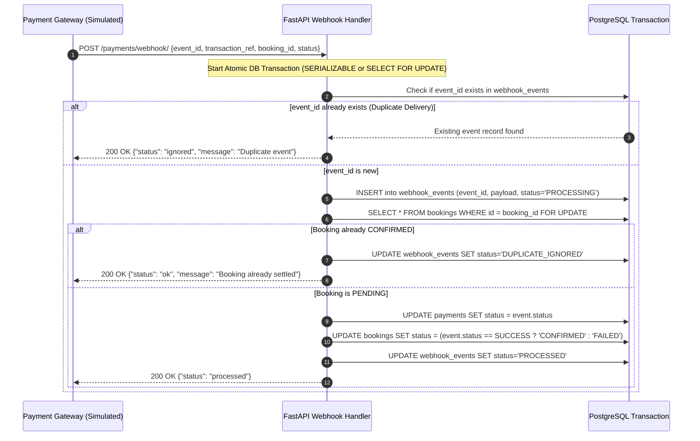

# Product Requirements Document (PRD)
## EVE Healthcare — Diagnostic Test Booking & Simulated Payment Service

**Document Version:** 1.0.0  
**Target Role:** SDE Intern — Backend Engineering Assignment  
**Author:** Engineering Team  
**Tech Stack:** Python 3.11+ / FastAPI / PostgreSQL / SQLAlchemy 2.0 / Pydantic v2 / Pytest / Docker  
**Status:** Approved for Implementation (Planning Phase — No Code Yet)

---

## 1. Executive Summary & Objectives

The goal of this project is to build a robust, production-grade backend service for EVE Healthcare that enables users to discover diagnostic centres, explore available diagnostic tests, book appointments, and process payments via a simulated payment gateway and an idempotent webhook mechanism.

### Key Objectives
1. **Clean Architectural Boundaries:** Clean separation of concerns (API routers, business logic/service layer, database access layer/repository, schemas).
2. **Data Integrity & Consistency:** Relational modeling in PostgreSQL with strict foreign keys, enum constraints, unique constraints, and atomic transactions.
3. **Idempotency & Concurrency Safety:** Guaranteed idempotent payment webhook processing that prevents duplicate bookings or corrupted financial states even under network replays or concurrent requests.
4. **2-Phase Execution Plan:**
   - **Phase 1 (Core Foundations & MVP):** All core functional requirements, DB design, state machine, edge-case guards, comprehensive unit/integration tests, and API documentation.
   - **Phase 2 (Production Hardening & Bonus Engineering):** Dockerization, Redis caching, Celery/background workers, rate limiting, structured logging, pagination, and retry queues.

---

## 2. High-Level System Architecture



---

## 3. Data Model & Database Schema Design

The schema is normalized to 3NF with explicit primary keys, foreign keys, timestamps, and indexes on query-heavy columns.



### Key Schema Constraints & Indexes
- **`centre_tests`**: Unique composite index on `(centre_id, test_id)` to prevent duplicate listings.
- **`payments`**: Unique index on `idempotency_key` and `transaction_reference`.
- **`webhook_events`**: Unique index on `event_id` to guarantee database-enforced deduplication.
- **`bookings`**: Foreign key to `centre_tests` with `ON DELETE RESTRICT` (cannot delete active test offerings with existing bookings).

---

## 4. State Machines & Lifecycle Transitions

### 4.1 Booking Lifecycle


### State Transition Validation Rules
| Current Status | Allowed Target Status | Trigger | Action / Consequence |
|---|---|---|---|
| `PENDING` | `CONFIRMED` | Payment Webhook `SUCCESS` | Slot confirmed, receipt issued |
| `PENDING` | `FAILED` | Payment Webhook `FAILED` | Booking marked failed; reason logged |
| `PENDING` | `CANCELLED` | User aborts checkout | Booking terminated |
| `CONFIRMED` | `CANCELLED` | Cancellation API | Triggers cancellation / audit |
| `CONFIRMED` | `FAILED` | **Disallowed (409 Conflict)** | Invalid state reversion |
| `FAILED` | Any | **Terminal State** | Immutable |
| `CANCELLED` | Any | **Terminal State** | Immutable |

---

## 5. Webhook Idempotency & Concurrency Strategy

Payment webhooks are notorious for network timeouts, retry spikes, and out-of-order delivery.



### Idempotency Pillars:
1. **Event Deduplication Store (`webhook_events`):** Unique constraint on `event_id`. Duplicate webhook requests hit an immediate early-return with HTTP 200 (preventing gateway retry storms).
2. **Row-Level Locking (`SELECT ... FOR UPDATE`):** When updating a booking and payment row, locking prevents race conditions if multiple workers handle concurrent status events for the same booking.
3. **Strict State Guards:** A booking in `CONFIRMED` or `CANCELLED` status cannot be regressed back to `PENDING` or `FAILED`.

---

## 6. API Specification & Endpoints Contract

### 6.1 Authentication Module
- `POST /api/v1/auth/signup`
  - Body: `{ email, password, full_name, phone_number }`
  - Response (201 Created): `{ id, email, full_name, role, created_at }`
- `POST /api/v1/auth/login`
  - Body: `{ email, password }`
  - Response (200 OK): `{ access_token, token_type: "bearer", expires_in }`
- `GET /api/v1/auth/me`
  - Header: `Authorization: Bearer <token>`
  - Response (200 OK): Current user profile

### 6.2 Centres & Diagnostic Tests Catalog Module
- `GET /api/v1/centres`
  - Query params: `city`, `is_active`, `page`, `page_size`
  - Response (200 OK): List of diagnostic centres
- `GET /api/v1/centres/{centre_id}`
  - Response (200 OK): Centre details including listed tests and prices
- `GET /api/v1/tests`
  - Query params: `category`, `search` (name)
  - Response (200 OK): Diagnostic test catalog
- `GET /api/v1/centres/{centre_id}/tests`
  - Response (200 OK): Tests available at specific centre with localized pricing
- `POST /api/v1/centres` *(Admin)* & `POST /api/v1/centres/{centre_id}/tests` *(Admin)*
  - Create centres and map tests with pricing

### 6.3 Booking Module
- `POST /api/v1/bookings`
  - Header: `Authorization: Bearer <token>`
  - Body: `{ centre_test_id, appointment_time, notes }`
  - Validations:
    - `centre_test_id` must be active and valid
    - `appointment_time` must be in the future (at least +1 hour from now)
    - Calculated `total_amount` is fetched from database authority, **never trusted from client input**
  - Response (201 Created): Booking object with status `PENDING`
- `GET /api/v1/bookings/my`
  - Header: `Authorization: Bearer <token>`
  - Response (200 OK): Paginated list of user's bookings
- `GET /api/v1/bookings/{booking_id}`
  - Header: `Authorization: Bearer <token>`
  - Response (200 OK): Details of the booking (owned by user or user is admin)
- `POST /api/v1/bookings/{booking_id}/cancel`
  - Header: `Authorization: Bearer <token>`
  - Validations: Only `PENDING` or `CONFIRMED` can be cancelled. `FAILED` cannot.

### 6.4 Simulated Payment & Webhook Module
- `POST /api/v1/payments/simulate`
  - Header: `Authorization: Bearer <token>`
  - Body: `{ booking_id, force_status: "SUCCESS" | "FAILED" | "RANDOM" }`
  - Behavior: Creates an initiated payment record, mocks an internal transaction reference, and simulates payment processing. Updates booking immediately or triggers internal webhook.
  - Response (200 OK): `{ payment_id, transaction_reference, booking_status, payment_status }`
- `POST /api/v1/payments/webhook`
  - Header: `X-Signature` (HMAC verification or simulated token)
  - Body:
    ```json
    {
      "event_id": "evt_987213892173",
      "event_type": "payment.updated",
      "timestamp": "2026-10-01T18:00:00Z",
      "data": {
        "transaction_reference": "txn_mock_12345",
        "booking_id": "c1f729b1-e234-4b4e-982d-2f08a9914b1c",
        "amount": 1499.00,
        "currency": "INR",
        "status": "SUCCESS", // or "FAILED"
        "failure_reason": null
      }
    }
    ```
  - Response:
    - 200 OK: `{ "status": "success", "message": "Event processed successfully" }`
    - 200 OK: `{ "status": "ignored", "message": "Duplicate event acknowledged" }`
    - 400 Bad Request: Missing event_id or malformed payload
    - 404 Not Found: Referenced booking or payment does not exist
    - 409 Conflict: Incompatible booking state transition

---

## 7. Edge Cases & Resilience Matrix

| # | Edge Case Category | Specific Scenario | Mitigation / Expected Behavior |
|---|---|---|---|
| 1 | **Financial Security** | Client submits custom `amount` in booking payload | Server ignores client amount; computes price strictly from DB `centre_tests.price`. |
| 2 | **Concurrent Webhooks** | Two identical webhook events delivered in parallel (<5ms apart) | First acquires row lock; second hits unique constraint on `event_id` or sees `status != PENDING` and gracefully returns 200 without duplicate action. |
| 3 | **Out-of-Order Webhook** | Webhook for `FAILED` arrives after booking was already marked `CONFIRMED` | State transition disallowed. Event logged as conflict/anomaly, HTTP 200/409 returned with audit log entry. |
| 4 | **Authorization Breach** | User A tries to view or cancel User B's booking | Strict ownership check in repository/service layer; returns `404 Not Found` (to prevent ID enumeration) or `403 Forbidden`. |
| 5 | **Stale / Past Appointments** | Booking created with appointment in the past | Request validation rejects appointment with `422 Unprocessable Entity`. |
| 6 | **Orphaned Payments** | Payment simulation invoked for non-existent or already `CANCELLED` booking | Validation check rejects payment initiation with `400 Bad Request`. |
| 7 | **Inactive Test / Centre** | Booking attempted for a deactivated centre or discontinued test | Database check verifies `is_active == True` and `is_available == True`, returns `400 Bad Request`. |

---

## 8. Two-Phase Implementation Roadmap

The assignment estimated time is 3–4 hours. Splitting into two clear phases guarantees delivering an exceptional, bug-free, fully tested core first (Phase 1), followed by high-leverage production bonus features (Phase 2).

### Phase 1: Core Foundation & MVP Backend (Evaluation Core)
*Primary Goal: 100% completion of assignment requirements, pristine code quality, database integrity, idempotent webhooks, and automated tests.*

#### Phase 1 Deliverables
1. **Architecture & Project Scaffolding:**
   - FastAPI application structured with layered architecture (`core/`, `models/`, `schemas/`, `api/v1/`, `services/`, `repositories/`).
   - Configuration management via `pydantic-settings` (.env support).
   - Database connection management (SQLAlchemy async/sync session, Alembic migrations).
2. **Data Modeling & Schema Migrations:**
   - 6 core models: `User`, `DiagnosticCentre`, `DiagnosticTest`, `CentreTest`, `Booking`, `Payment`, `WebhookEvent`.
   - Seed script for initial diagnostic centres and tests (e.g., Apollo Diagnostics, Dr. Lal PathLabs; CBC, Lipid Profile, Thyroid Panel).
3. **Authentication & Authorization:**
   - User signup and login with bcrypt password hashing.
   - JWT token generation, signature verification, and FastAPI dependency (`get_current_user`).
4. **Diagnostic Catalog APIs:**
   - Endpoints to list centres, filter tests, and retrieve test pricing.
5. **Booking Engine & State Machine:**
   - Atomic booking creation with server-side price lookup.
   - Status tracking (`PENDING`, `CONFIRMED`, `FAILED`, `CANCELLED`).
6. **Simulated Payment & Idempotent Webhook:**
   - Simulated payment trigger (`POST /payments/`).
   - Idempotent webhook receiver (`POST /payments/webhook/`) with event deduplication table and transaction locking.
7. **Comprehensive Unit & Integration Test Suite:**
   - Test user registration and auth tokens.
   - Test booking lifecycle flow.
   - **Crucial:** Test webhook idempotency by firing duplicate and triple events to ensure zero duplicate updates.
   - Test unauthorized access prevention.
8. **Documentation:**
   - Auto-generated OpenAPI / Swagger docs (`/docs`).
   - Detailed `README.md` with setup steps, schema diagram, curl examples, and design rationale.

---

### Phase 2: Production Readiness, Scalability & Bonus Features
*Primary Goal: Elevate the service into an enterprise-ready system demonstrating advanced engineering capability.*

#### Phase 2 Deliverables
1. **Docker & Orchestration:**
   - Multi-stage production `Dockerfile` with minimal footprint and non-root user.
   - `docker-compose.yml` orchestrating FastAPI backend, PostgreSQL 16 database, and Redis.
   - Healthcheck integration in Docker Compose.
2. **Caching Layer (Redis):**
   - Cache high-read endpoints (`/centres`, `/tests`) using Redis with configurable TTL (e.g., 10 minutes).
   - Cache invalidation hook when centre/test catalog is modified.
3. **Asynchronous Background Processing (Worker / Celery / BackgroundTasks):**
   - Background tasks for booking notification simulation (email/SMS receipt on confirmation).
   - Automated cleanup job: Cancel bookings stuck in `PENDING` payment after a timeout window (e.g., 15 minutes) to free inventory.
4. **Rate Limiting & Security Hardening:**
   - Redis-backed rate limiting on sensitive endpoints (e.g., max 5 login attempts/min, max 20 payment simulations/min).
   - CORS middleware configuration and security headers.
5. **Resilience & Webhook Retry Mechanism:**
   - Dead-letter queue (DLQ) simulation or retry scheduler for failed webhook processing.
   - HMAC SHA-256 signature verification for webhook authenticity.
6. **Observability & Structured Logging:**
   - Structured JSON logging with request correlation IDs (`X-Request-ID`).
   - Latency tracking middleware.
   - Standard `/health` and `/ready` probes.
7. **Advanced API Ergonomics:**
   - Standardized cursor/offset pagination helper and envelope responses.

---

## 9. Evaluation Criteria Mapping

This design directly satisfies all weights outlined in the assignment rubric:

| Evaluation Area | Weight | How This PRD Guarantees Excellence |
|---|---|---|
| **Code Quality & Maintainability** | 20% | Layered Clean Architecture (Routers -> Services -> Repositories -> Models), type hints everywhere, Pydantic validation, PEP-8 compliance. |
| **API / Backend Design** | 20% | RESTful standards, canonical status codes (201, 200, 400, 401, 403, 404, 409, 422), auto-generated Swagger documentation. |
| **Database Design** | 15% | Normalized 3NF schema, UUID primary keys, composite unique constraints, foreign key cascades/restrictions, explicit status ENUMs. |
| **Edge-Case Handling** | 15% | Dedicated edge-case matrix; guaranteed idempotency with duplicate webhook replay protection; client price tampering prevention. |
| **Tests** | 10% | Pytest test suite covering auth, state transitions, security bounds, and concurrent/repeated webhook simulations. |
| **Git / README / Documentation** | 10% | Crystal-clear README with setup instructions, ERD, architectural trade-offs, and future improvements. |
| **Bonus Engineering** | 10% | Dedicated Phase 2 containing Docker, Docker Compose, Redis caching, rate limiting, and structured logging. |

---

## 10. Next Steps & Approval Checklist

Before commencing implementation, we confirm:
- [x] Product requirements and domain model verified against EVE Healthcare assignment.
- [x] Clear boundary established between Phase 1 (Core) and Phase 2 (Bonus & Hardening).
- [x] Zero code written in the planning phase as requested.
- [ ] User review and feedback on the proposed architecture, database schema, and phase split.
- [ ] Green light to begin Phase 1 setup and database scaffolding.
