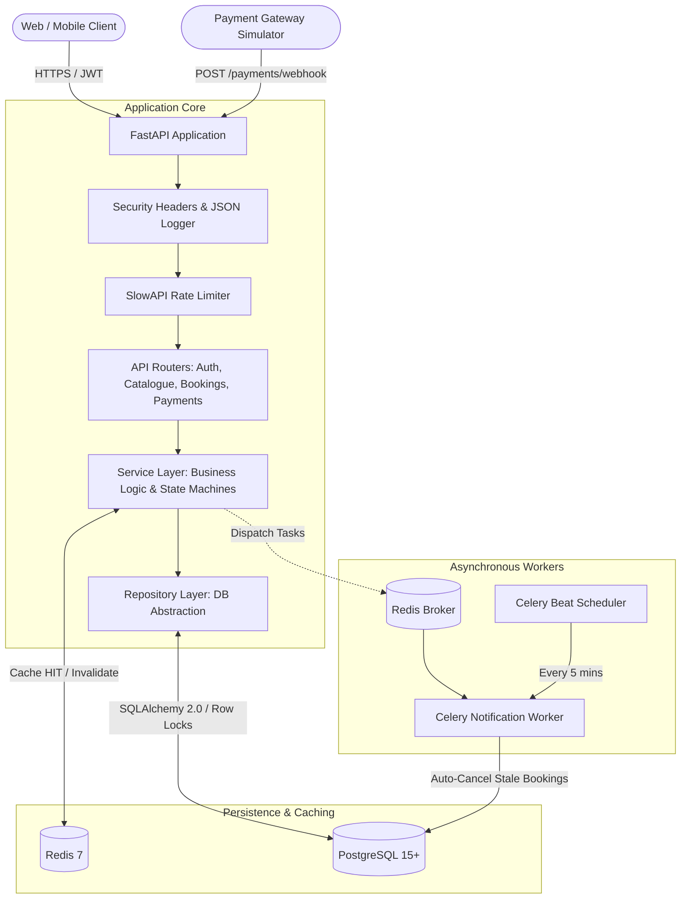

# EVE Healthcare — Diagnostic Test Booking & Payment Service

A production-grade backend service for managing diagnostic healthcare appointments, test discovery, simulated payment processing, and idempotent webhook handling. Built with FastAPI, PostgreSQL, Redis, and Celery.

---

## 1. Project Overview

EVE Healthcare provides a robust RESTful API that allows patients to explore diagnostic centres, browse medical tests with centre-specific pricing, schedule appointments, and complete payments. The service is engineered to prioritize financial data integrity, defensive authorization, and concurrency safety.

Payment processing supports simulated gateways with configurable outcomes as well as external webhook updates. The webhook engine incorporates database-level row locking, an event deduplication store, and strict state machine rules to guarantee that payment events remain idempotent under network retries, out-of-order deliveries, and concurrent requests.

---

## 2. Tech Stack

| Layer | Technologies |
|---|---|
| **Language & Framework** | Python 3.11+ / 3.13, FastAPI, Uvicorn, Pydantic v2 |
| **Database & ORM** | PostgreSQL 15+ (tested on PostgreSQL 15 and 17), SQLAlchemy 2.0, Alembic |
| **Caching & Rate Limiting** | Redis 7, SlowAPI |
| **Background Processing** | Celery 5, Kombu, Celery Beat |
| **Security & Auth** | Passlib (bcrypt), Python-Jose (JWT HS256), HMAC-SHA256 |
| **Testing & Observability** | Pytest, Pytest-Asyncio, HTTPX, Python-JSON-Logger |
| **Infrastructure** | Docker, Docker Compose (multi-stage non-root build) |

---

## 3. How the System Works

The system operates across three core workflows: catalogue discovery, booking lifecycle management, and payment processing.

**Catalogue Discovery & Pricing:** Diagnostic centres and diagnostic tests are managed independently. A centre associates itself with tests via a join model that defines localized pricing and test availability. Pricing is strictly authoritative on the server: clients never submit monetary amounts, eliminating price-tampering vulnerabilities. Catalogue listings are cached in Redis for fast read performance and automatically invalidated when catalogue data is modified.

**Booking Lifecycle:** A patient schedules an appointment by selecting a centre-test offering and an appointment time (which must be at least one hour in the future). This creates a booking in the `PENDING` status. The booking holds the snapshot price at the time of creation.

**Payment Processing & State Transitions:** Payments can be initiated directly through the payment simulation endpoint or updated via webhook callbacks. When a payment succeeds, the booking atomically transitions to `CONFIRMED`, and an asynchronous notification task is dispatched via Celery. If the payment fails, the booking transitions to `FAILED`. A settled booking (`CONFIRMED` or `FAILED`) cannot be paid again, and terminal bookings cannot be reverted by out-of-order webhook events.

```
                  ┌───────────────┐
                  │    PENDING    │
                  └───────┬───────┘
                          │
            ┌─────────────┴─────────────┐
            │                           │
    [Payment Success]           [Payment Failed /
            │                    Expired Timeout]
            ▼                           ▼
    ┌───────────────┐           ┌───────────────┐
    │   CONFIRMED   │           │    FAILED     │
    └───────┬───────┘           └───────────────┘
            │
    [User Cancel]
            │
            ▼
    ┌───────────────┐
    │   CANCELLED   │
    └───────────────┘
```

---

## 4. Architecture

The application adopts a clean layered architecture with clear separation of concerns across presentation, business logic, data persistence, and asynchronous worker tasks.



- **Routers (`app/api/v1/`):** Handle request routing, dependency injection, and schema serialization.
- **Services (`app/services/`):** Enforce domain invariants, state machines, authorization checks, and cache orchestration.
- **Repositories (`app/repositories/`):** Encapsulate SQLAlchemy database queries and row-level locking mechanisms.
- **Workers (`app/worker/`):** Execute background jobs and periodic tasks asynchronously without blocking HTTP request threads.

---

## 5. Main Features

**JWT Authentication & Role-Based Access Control:** Secure registration and login workflows using bcrypt password hashing. Access tokens are HS256-signed JWTs carrying user identities and roles (`PATIENT`, `ADMIN`).

**Server-Authoritative Pricing:** Booking costs are resolved on the server by querying the database for the selected centre-test record. Client-supplied price modifications are entirely ignored.

**Idempotent Webhooks & Concurrency Protection:** Incoming webhook events are recorded in a dedicated deduplication table indexed by a unique `event_id`. Before modifying a booking, the service acquires a database row-level lock (`SELECT FOR UPDATE`), preventing concurrent duplicate events from corrupting financial or booking state.

**Redis Caching Layer:** High-read catalogue endpoints utilize Redis caching with configurable TTL. Caches are purged automatically when centres or tests are created or modified, preventing stale catalogue views.

**Asynchronous Workers & Cleanup:** Email/SMS notifications are processed asynchronously via Celery with automatic exponential retries. A periodic Celery Beat schedule identifies and cancels bookings that remain unpaid past the 15-minute expiration threshold.

**Defensive Security:** Object-level authorization checks prevent Insecure Direct Object References (IDOR). If a user queries or cancels an appointment belonging to another patient, the API returns `404 Not Found` rather than `403 Forbidden` to prevent resource ID enumeration.

---

## 6. API Reference

All application endpoints are versioned under `/api/v1`. Interactive Swagger documentation is available at `/docs`, ReDoc at `/redoc`, and OpenAPI JSON specification at `/openapi.json`.

### Authentication (`/api/v1/auth`)

| Method | Endpoint | Auth | Description |
|---|---|---|---|
| `POST` | `/api/v1/auth/signup` | Public | Register a patient account with email, name, phone, and password |
| `POST` | `/api/v1/auth/login` | Public | Authenticate user; returns JWT Bearer token (rate-limited: 5/min) |
| `GET` | `/api/v1/auth/me` | Bearer | Retrieve currently authenticated user profile |

### Diagnostic Catalogue (`/api/v1`)

| Method | Endpoint | Auth | Description |
|---|---|---|---|
| `GET` | `/api/v1/centres` | Public | List diagnostic centres (Redis-cached, filter by `city`, `is_active`) |
| `GET` | `/api/v1/centres/{id}` | Public | Retrieve a specific diagnostic centre by ID |
| `POST` | `/api/v1/centres` | Bearer | Create a new diagnostic centre (invalidates catalogue cache) |
| `GET` | `/api/v1/centres/{id}/tests` | Public | List tests and prices offered at a centre |
| `POST` | `/api/v1/centres/{id}/tests` | Bearer | Map a test to a centre with localized pricing (invalidates cache) |
| `GET` | `/api/v1/tests` | Public | List diagnostic tests (Redis-cached, filter by `category`, `search`) |
| `POST` | `/api/v1/tests` | Bearer | Register a new diagnostic test definition |

### Bookings (`/api/v1/bookings`)

| Method | Endpoint | Auth | Description |
|---|---|---|---|
| `POST` | `/api/v1/bookings` | Bearer | Book a test appointment (server-computed price, `PENDING` status) |
| `GET` | `/api/v1/bookings/my` | Bearer | List bookings for current user with pagination |
| `GET` | `/api/v1/bookings/{id}` | Bearer | Retrieve booking details (returns 404 if owned by another user) |
| `POST` | `/api/v1/bookings/{id}/cancel` | Bearer | Cancel an appointment (`PENDING` or `CONFIRMED` only) |

### Payments & Webhooks (`/api/v1/payments`)

| Method | Endpoint | Auth | Description |
|---|---|---|---|
| `POST` | `/api/v1/payments/` | Bearer | Simulate payment (`force_status: "SUCCESS" \| "FAILED" \| "RANDOM"`) |
| `POST` | `/api/v1/payments/simulate` | Bearer | Alias for payment simulation |
| `POST` | `/api/v1/payments/webhook` | Optional HMAC | Idempotent webhook receiver (`event_id` deduplication, row locks) |

### Observability

| Method | Endpoint | Auth | Description |
|---|---|---|---|
| `GET` | `/health` | Public | Liveness probe returning HTTP 200 and version metadata |
| `GET` | `/ready` | Public | Readiness probe verifying PostgreSQL and Redis connectivity |

---

## 7. Database Design

The relational schema is normalized to Third Normal Form (3NF) with explicit primary keys, foreign key constraints, and performance indexes.

```
users
├── id: UUID [PK]
├── email: VARCHAR(255) [UNIQUE, INDEX]
├── hashed_password: VARCHAR(255)
├── full_name: VARCHAR(255), phone_number: VARCHAR(20)
├── role: ENUM ('PATIENT', 'ADMIN')
├── is_active: BOOLEAN (DEFAULT TRUE)
└── created_at, updated_at: TIMESTAMPTZ (DEFAULT now())

diagnostic_centres
├── id: UUID [PK]
├── name: VARCHAR(255), address: TEXT, pincode: VARCHAR(10)
├── city: VARCHAR(100) [INDEX]
├── is_active: BOOLEAN (DEFAULT TRUE)
└── created_at: TIMESTAMPTZ (DEFAULT now())

diagnostic_tests
├── id: UUID [PK]
├── name: VARCHAR(255) [UNIQUE, INDEX]
├── category: VARCHAR(100), sample_type: VARCHAR(100), description: TEXT
└── created_at: TIMESTAMPTZ (DEFAULT now())

centre_tests (Join Table with Localized Pricing)
├── id: UUID [PK]
├── centre_id: UUID [FK → diagnostic_centres.id, ON DELETE RESTRICT]
├── test_id: UUID [FK → diagnostic_tests.id, ON DELETE RESTRICT]
├── price: NUMERIC(10, 2) [CHECK (price > 0)]
├── is_available: BOOLEAN (DEFAULT TRUE)
├── created_at: TIMESTAMPTZ (DEFAULT now())
└── CONSTRAINT: UNIQUE (centre_id, test_id)

bookings
├── id: UUID [PK]
├── user_id: UUID [FK → users.id, ON DELETE RESTRICT, INDEX]
├── centre_test_id: UUID [FK → centre_tests.id, ON DELETE RESTRICT]
├── appointment_time: TIMESTAMPTZ
├── total_amount: NUMERIC(10, 2)
├── status: ENUM ('PENDING', 'CONFIRMED', 'FAILED', 'CANCELLED') [INDEX]
├── notes: TEXT
└── created_at, updated_at: TIMESTAMPTZ (DEFAULT now())

payments
├── id: UUID [PK]
├── booking_id: UUID [FK → bookings.id, ON DELETE RESTRICT, INDEX]
├── idempotency_key: VARCHAR(255) [UNIQUE, INDEX]
├── transaction_reference: VARCHAR(255) [UNIQUE, INDEX]
├── amount: NUMERIC(10, 2)
├── status: ENUM ('INITIATED', 'SUCCESS', 'FAILED')
├── failure_reason: TEXT, provider_metadata: JSON
└── created_at, updated_at: TIMESTAMPTZ (DEFAULT now())

webhook_events (Deduplication Store)
├── id: UUID [PK]
├── event_id: VARCHAR(255) [UNIQUE, INDEX]
├── event_type: VARCHAR(100), payload: JSON
├── processing_status: ENUM ('PROCESSED', 'DUPLICATE_IGNORED', 'FAILED')
├── received_at: TIMESTAMPTZ (DEFAULT now())
└── processed_at: TIMESTAMPTZ
```

---

## 8. Security & Reliability

The application incorporates defenses against common backend attack vectors and distributed data edge cases:

| Vector / Threat | Engineered Mitigation |
|---|---|
| **Price Tampering** | Booking amounts are fetched exclusively from `centre_tests.price` on the database server. Client-provided prices are ignored. |
| **Insecure Direct Object Reference (IDOR)** | Ownership verification on bookings and payments returns `404 Not Found` for unauthorized users, preventing resource ID enumeration. |
| **Concurrent Duplicate Webhooks** | Unique constraint on `webhook_events.event_id` combined with `SELECT FOR UPDATE` booking row locks prevents race conditions and duplicate updates. |
| **Out-of-Order Webhooks** | State machine validation ensures settled bookings (`CONFIRMED`) cannot be reverted to `FAILED` by delayed gateway delivery. |
| **Brute Force & Flooding** | SlowAPI enforces rate limits on authentication (`5/min`) and payments (`20/min`) using Redis storage. |
| **Webhook Spoofing** | Optional HMAC-SHA256 signature verification (`X-Eve-Signature`) validates webhook authenticity in production environments. |
| **Stale / Abandoned Bookings** | Celery Beat periodic job cancels `PENDING` bookings older than 15 minutes to release appointment capacity. |

---

## 9. Running Locally

### Prerequisites
- Python 3.11+
- PostgreSQL 15+ running locally (default port 5432)
- Redis 7+ running locally (default port 6379)

### Setup Steps

```bash
# 1. Clone the repository and navigate into the workspace
git clone <repository-url>
cd "eve healthcare"

# 2. Create and activate a virtual environment
python3 -m venv venv
source venv/bin/activate

# 3. Install dependencies
pip install -r requirements.txt

# 4. Configure environment variables
cp .env.example .env
# Edit .env with your local PostgreSQL and Redis connection URLs

# 5. Populate database with sample centres, tests, and admin user
python scripts/seed_db.py

# 6. Start the API development server
uvicorn app.main:app --host 127.0.0.1 --port 8000 --reload
```

The service will be live at `http://localhost:8000`. You can explore the interactive API documentation at `http://localhost:8000/docs`.

---

## 10. Running with Docker

Docker Compose orchestrates the complete production topology: FastAPI application, PostgreSQL 15, Redis 7, Celery Worker, and Celery Beat scheduler.

```bash
# Build images and start all 5 services in detached mode
docker-compose up -d --build

# Inspect running service status
docker-compose ps

# Follow container logs
docker-compose logs -f app
```

Container endpoints:
- **API Server & Docs:** `http://localhost:8000/docs`
- **Liveness Probe:** `http://localhost:8000/health`
- **Readiness Probe:** `http://localhost:8000/ready`
- **PostgreSQL Database:** `localhost:5433` (container port 5432 mapped to 5433 to avoid local port conflicts)
- **Redis Server:** `localhost:6379`

To stop and remove containers:
```bash
docker-compose down -v
```

---

## 11. Background Workers

Background asynchronous processing is managed by Celery with Redis serving as the message broker.

- **`send_booking_notification`:** Triggered upon payment status changes. Formats and dispatches email/SMS notifications asynchronously, keeping HTTP payment responses under 20ms. Configured with up to 3 automatic retries and exponential backoff.
- **`auto_cancel_stale_bookings`:** Periodic Celery Beat job executing every 5 minutes. It scans for bookings remaining in the `PENDING` state past the timeout threshold (`PENDING_BOOKING_TIMEOUT_MINUTES=15`) and marks them `CANCELLED`.

To run the workers locally outside Docker:

```bash
# Terminal 1: Celery Worker
celery -A app.worker.tasks.celery_app worker --loglevel=info

# Terminal 2: Celery Beat Scheduler
celery -A app.worker.tasks.celery_app beat --loglevel=info
```

---

## 12. Testing

The repository contains an automated test suite comprising unit and integration tests. Tests run with an isolated database configuration and an in-memory fallback rate limiter.

```bash
# Run the complete test suite with coverage report
pytest -v
```

### Verified Test Results

```
collected 68 items

tests/integration/test_bookings.py ..........................            [ 38%]
tests/integration/test_catalogue.py ................                     [ 61%]
tests/integration/test_payments.py .............                         [ 80%]
tests/integration/test_phase2_features.py ...........                    [ 97%]
tests/unit/test_auth.py ...........                                      [100%]

======================= 68 passed in 20.92s =======================
TOTAL STATEMENT COVERAGE: 93%
```

### Live End-to-End Verification

A dedicated end-to-end verification script validates the full lifecycle against a running server:

```bash
# Start server in one terminal: uvicorn app.main:app --port 8000
# Run the live verification script in another terminal:
python scripts/verify_e2e.py
```

The script verifies:
1. Health and readiness probes (`/health`, `/ready`)
2. Patient signup, login, and JWT profile retrieval
3. Diagnostic centre and test catalogue discovery with localized pricing
4. Booking creation and appointment validation
5. IDOR access prevention (confirming 404 response on unauthorized queries)
6. Simulated payment success transitioning booking to `CONFIRMED`
7. Rejection of duplicate payment attempts on settled bookings
8. Simulated payment failure transitioning booking to `FAILED`
9. Webhook deduplication across duplicate, repeated, and out-of-order deliveries

---

## 13. Example Booking Flow

Here is a typical end-to-end flow using `curl`:

**Step 1: Patient Registration**
```bash
curl -X POST http://localhost:8000/api/v1/auth/signup \
  -H "Content-Type: application/json" \
  -d '{
    "email": "patient@example.com",
    "password": "SecurePassword@123",
    "full_name": "Jane Doe",
    "phone_number": "+919876543210"
  }'
```

**Step 2: Patient Login**
```bash
curl -X POST http://localhost:8000/api/v1/auth/login \
  -H "Content-Type: application/json" \
  -d '{"email": "patient@example.com", "password": "SecurePassword@123"}'
# Returns: {"access_token": "eyJhbGciOi...", "token_type": "bearer"}
```

**Step 3: Discover Centres & Tests**
```bash
# List available centres
curl http://localhost:8000/api/v1/centres

# Fetch available tests at Apollo Diagnostics
curl http://localhost:8000/api/v1/centres/<centre_id>/tests
```

**Step 4: Create a Booking**
```bash
curl -X POST http://localhost:8000/api/v1/bookings \
  -H "Authorization: Bearer <TOKEN>" \
  -H "Content-Type: application/json" \
  -d '{
    "centre_test_id": "<centre_test_id>",
    "appointment_time": "2026-10-10T10:00:00Z",
    "notes": "Routine annual checkup"
  }'
# Returns: {"id": "<booking_id>", "status": "PENDING", "total_amount": 550.00}
```

**Step 5: Process Payment**
```bash
curl -X POST http://localhost:8000/api/v1/payments/ \
  -H "Authorization: Bearer <TOKEN>" \
  -H "Content-Type: application/json" \
  -d '{"booking_id": "<booking_id>", "force_status": "SUCCESS"}'
# Returns: {"payment_status": "SUCCESS", "booking_status": "CONFIRMED"}
```

**Step 6: Webhook Delivery (Gateway Callback)**
```bash
curl -X POST http://localhost:8000/api/v1/payments/webhook \
  -H "Content-Type: application/json" \
  -d '{
    "event_id": "evt_987654321",
    "event_type": "payment.updated",
    "timestamp": "2026-10-10T10:05:00Z",
    "data": {
      "transaction_reference": "<transaction_reference>",
      "booking_id": "<booking_id>",
      "amount": 550.00,
      "currency": "INR",
      "status": "SUCCESS"
    }
  }'
# First call returns: {"status": "processed", "message": "..."}
# Subsequent calls return: {"status": "ignored", "message": "Duplicate event..."}
```

---

## 14. Project Structure

```
eve-healthcare/
├── app/
│   ├── api/
│   │   └── v1/
│   │       ├── endpoints/
│   │       │   ├── auth.py          # Signup, login, profile routes
│   │       │   ├── bookings.py      # Booking creation, listing, cancellation
│   │       │   ├── catalogue.py     # Centres, tests, and pricing catalogue
│   │       │   └── payments.py      # Payment simulation and webhook receiver
│   │       └── router.py            # Aggregated v1 API router
│   ├── core/
│   │   ├── cache.py                 # Redis client, key builders, rate limiter
│   │   ├── config.py                # Pydantic Settings application config
│   │   ├── logging.py               # Structured JSON log formatting
│   │   ├── middleware.py            # Request ID correlation & security headers
│   │   ├── security.py              # Password hashing and JWT helpers
│   │   └── webhook_auth.py          # HMAC-SHA256 signature verification
│   ├── db/
│   │   └── session.py               # SQLAlchemy engine and session dependency
│   ├── models/
│   │   └── models.py                # Normalized SQLAlchemy 3NF models
│   ├── repositories/
│   │   ├── booking_repository.py    # Booking persistence & row-level locking
│   │   ├── catalogue_repository.py  # Centres, tests, and pricing data queries
│   │   ├── payment_repository.py    # Payments and webhook deduplication store
│   │   └── user_repository.py       # User authentication and profile queries
│   ├── schemas/
│   │   ├── auth.py                  # Signup, login, and token Pydantic models
│   │   ├── booking.py               # Booking request and response schemas
│   │   ├── catalogue.py             # Centre and test schemas with pricing
│   │   └── payment.py               # Simulation and webhook event payload models
│   ├── services/
│   │   ├── auth_service.py          # User registration and token creation
│   │   ├── booking_service.py       # Authoritative pricing & state transitions
│   │   ├── catalogue_service.py     # Catalogue queries with Redis caching
│   │   └── payment_service.py       # Payment processing & idempotent webhooks
│   ├── worker/
│   │   └── tasks.py                 # Celery app, notifications, and periodic cleanup
│   └── main.py                      # FastAPI factory, lifespan, and probes
├── scripts/
│   ├── seed_db.py                   # Populates initial centres, tests, and admin
│   └── verify_e2e.py                # End-to-end verification test suite
├── tests/
│   ├── conftest.py                  # Pytest fixtures and mock dependencies
│   ├── integration/
│   │   ├── test_bookings.py         # Booking creation, authorization, and cancellation
│   │   ├── test_catalogue.py        # Catalogue listing, filters, and offerings
│   │   ├── test_payments.py         # Payment simulation and webhook idempotency
│   │   └── test_phase2_features.py  # Probes, rate limiting, HMAC, and Celery
│   └── unit/
│       └── test_auth.py             # User signup, password strength, and login
├── docker-compose.yml               # Multi-container orchestration
├── Dockerfile                       # Multi-stage production container build
├── pytest.ini                       # Test runner configuration
├── requirements.txt                 # Pinned project dependencies
├── .env.example                     # Environment configuration template
├── .gitignore                       # Git ignore rules
└── README.md                        # Project documentation
```

---

## 15. Future Improvements

- **Live Payment Gateway Integrations:** Integrate production payment provider SDKs (such as Razorpay, Stripe, or Cashfree) using an adapter pattern.
- **Cart & Multi-Test Bookings:** Extend the booking engine to support grouping multiple diagnostic tests into a single appointment order.
- **Patient Notification Channels:** Connect the Celery notification worker to live email (SendGrid, AWS SES) and SMS gateways (Twilio, Gupshup).
- **Read Replicas:** Configure SQLAlchemy routing engines to direct read queries to PostgreSQL read replicas while routing mutations to the primary database.
